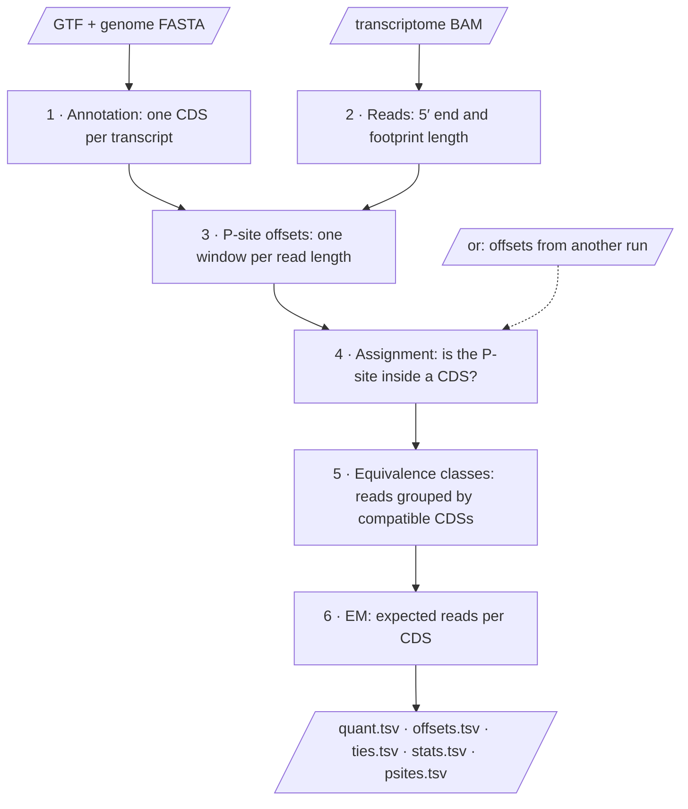
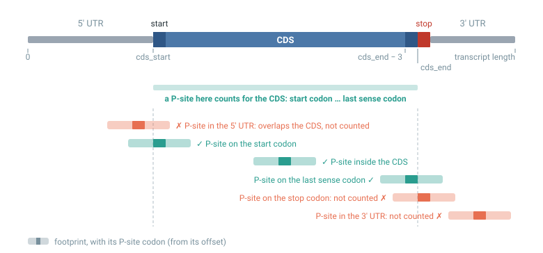
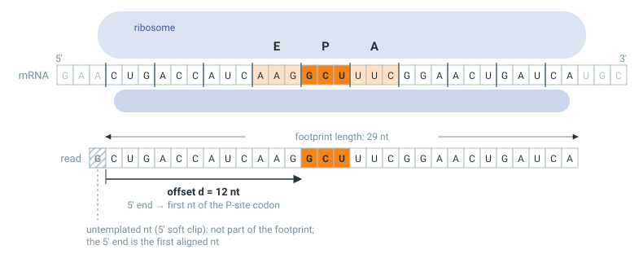
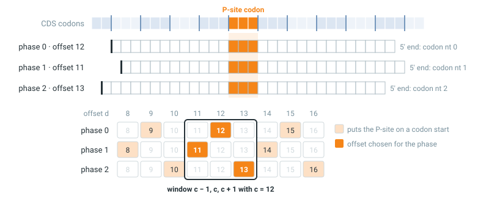

# Method

`ribokit quant` turns ribosome footprints aligned to a transcriptome into
expected read counts per coding sequence (CDS). For every read it answers three
questions:

1. **Where was the ribosome?** The footprint's 5′ end is not the codon being
   translated. ribokit estimates, from the data, how far the P-site codon sits
   from the 5′ end (the *P-site offset*).
2. **Was it translating a CDS?** A read counts for a CDS only if its P-site is
   inside that CDS, not merely if the read overlaps it.
3. **Which CDS?** A read can fit several CDSs (isoforms, paralogs). ribokit
   splits such reads by expectation-maximisation (EM), in proportion to each
   CDS's density of ribosomes, accelerated so that near-identical CDSs don't
   take forever to split ([step 6](#6-em)).

This page covers `ribokit quant`. For uORFs and other ORFs besides the CDS,
see [ORF counting and frame scores](orfs.md) (`ribokit orfs` / `ribokit score`).

## At a glance



| Problem | What ribokit does |
|---|---|
| The P-site sits about 12 nt from a footprint's 5′ end, and the exact distance depends on footprint length and trimming. | Estimates one offset per read length and phase from the reads that span the start codon or the last sense codon ([step 3](#3-p-site-offsets)). |
| Footprints that overlap a CDS were not all made by ribosomes translating it, e.g. ribosomes in the 5′ UTR next to the start codon. | Counts a read for a CDS only if its P-site is inside it ([step 4](#4-assignment)). |
| Reads fit several CDSs when transcripts share sequence. | Splits them by EM with a length term, so shared reads go by density, not by read count ([step 6](#6-em)). |
| Some CDSs cannot be told apart by any read. | Lists them in `ties.tsv`: the split between them comes from the model, not from the data ([step 6](#ties)). |
| Library preparation adds untemplated nucleotides at the 5′ end. | Excludes a 5′ soft clip from the footprint instead of dropping the read ([step 2](#2-reads)). |
| Results must be reproducible. | No randomness anywhere; a rerun gives byte-identical output; an EM that does not converge is an error. |

## 1. Annotation

ribokit reads the `exon` and `CDS` features of the GTF and keeps one CDS per
transcript, in transcript coordinates (0-based):

<figure markdown="span">
  
  <figcaption>The CDS runs from <code>cds_start</code> (first nt of the start codon) to
  <code>cds_end</code> (one past the last sense codon); the stop codon is never part of it.
  A footprint counts for the CDS when its P-site codon lies between the start codon and
  the last sense codon.</figcaption>
</figure>

- **Stop codon in or out?** GTFs differ on whether the CDS feature includes the
  stop codon. ribokit decides by majority vote over all CDSs whose length is a
  multiple of 3: is the last annotated codon a stop, or the codon after it? If
  neither holds for most CDSs, the FASTA probably does not belong to the GTF,
  and ribokit stops with an error.
- **Dropped CDSs:** length not a multiple of 3; no stop codon after the last
  codon; CDS not contiguous in the transcript. Non-ATG starts are kept.
- The BAM's reference lengths must match the transcript lengths from the GTF.

Every count is in `stats.tsv` (`annotation_*` rows).

## 2. Reads

<figure markdown="span">
  
  <figcaption>A footprint and its P-site offset <i>d</i>: the number of nucleotides from the
  footprint's 5′ end to the first nucleotide of the P-site codon. An untemplated nucleotide
  at the 5′ end shows up as a soft clip and is not part of the footprint.</figcaption>
</figure>

An alignment is used if it is mapped, on the forward strand of the transcript,
and primary or secondary (supplementary alignments are skipped). Its CIGAR must
be matches with optional soft clips at the ends:

- A **5′ soft clip** is taken as untemplated nucleotides added during library
  preparation. The footprint's 5′ end is the first aligned base, and its length
  excludes the clip.
- A **3′ soft clip** is part of the footprint and counts toward its length.
- Alignments with insertions, deletions, skipped regions, hard clips or padding
  are dropped (`alignments_dropped_cigar`).

Each read name counts as one read, however many alignments it has. Reads
outside `--read-lengths`, and alignments to transcripts without a valid CDS, are
set aside before offsets are estimated.

## 3. P-site offsets

### Offsets, phases and the codon frame

The *phase* of an alignment is the position of its 5′ end within the codon
frame of its transcript's CDS:

$$
\text{phase} = (\text{5' end} - \texttt{cds_start}) \bmod 3
$$

A P-site lands on the first nucleotide of a codon exactly when
$(d + \text{phase}) \bmod 3 = 0$. So the offset depends on the footprint length
*and* the phase, and ribokit estimates one offset for every (length, phase) class.

### CDS inclusion

The idea ([Ahmed et al. 2019](#references)): the right offset puts the most
P-sites inside CDSs. Most reads lie well inside a CDS and are inside whatever the
offset; they do not discriminate. The reads that do are those that **span the
start codon or the last sense codon**:

- an offset that is too short moves the P-sites of ribosomes on the start codon
  into the 5′ UTR;
- an offset that is too long moves the P-sites of ribosomes on the last codon
  past the end of the CDS.

ribokit scores each candidate offset by the number of reads whose P-site it
puts inside the CDS (a read with *n* alignments counts 1/*n* at each). The reads
that cover the first nt of the start codon or of the last sense codon are the
class's *support*.

### One window per read length

ribokit does not choose the three phases of a read length independently.
Footprints of the same length but different phase differ by a nucleotide of
trimming at each end, so ribokit requires their offsets to be **three
consecutive numbers** $c-1, c, c+1$. Each of the three goes to the phase it puts
in frame:

<figure markdown="span">
  
  <figcaption>Top: three footprints of length 29 with their P-site on the same codon.
  Their 5′ ends sit on different nucleotides of a codon (phases 0, 1, 2), so their
  offsets are 12, 11 and 13. Bottom: each phase can only take every third offset;
  any window of three consecutive offsets gives exactly one to each phase.</figcaption>
</figure>

For each read length, ribokit sums the three phases' scores for every window
centre $c$ and keeps the best window; on a tie, the smaller $c$. The P-site codon
must leave room for an E-site codon before it and an A-site codon after it in
the read, so $3 \le d \le \text{length} - 6$.

Try it on simulated footprints of length 29 (true offsets 12, 11, 13):

<div class="rk-widget" id="offset-explorer"><noscript>This interactive example needs JavaScript.</noscript></div>

*Each row is a footprint, coloured by where the current window puts its P-site
(darker block): <span style="color:#2a9d8f">inside the CDS</span> or
<span style="color:#e76f51">outside</span>. Below: how many of the spanning
footprints each window puts inside. Click a bar or drag the slider. For any
window other than the best, the readout counts the reads the two disagree on:
the numbers [z](#what-offsetstsv-reports) is built from.*

Choosing each phase on its own lets the three offsets of a length drift apart
and was unstable between libraries; the window shares the evidence across the
three phases.

### What `offsets.tsv` reports

One row per (length, phase): `offset`, `support` (weighted reads that cover the
first nt of the start codon or of the last sense codon), `z` and `reads`.

`z` says how firmly the data pin this phase's offset. Windows next to each other
differ in one phase only: moving the centre from $c$ to $c + 1$ swaps offset
$c - 1$ for $c + 2$, and both belong to the same phase. So the evidence is
measured per phase, against the phase's **rival**: the best window that gives
this phase a different offset.

```
29 nt               window              phase 0  phase 1  phase 2
chosen              c = 12  (11,12,13)     12       11       13
rival of phase 2    c = 11  (10,11,12)     12       11       10     only phase 2 differs
rival of phase 1    c = 13  (12,13,14)     12       14       13     only phase 1 differs
rival of phase 0    c = 14  (13,14,15)     15       14       13     phases 0 and 1 differ
```

(The rivals of the worked example's 29 nt reads. The phase whose offset is the
centre $c$ can only change together with another phase.)

Most reads are counted by both windows and say nothing about the choice. The
reads that one window counts and the other does not are mostly ribosomes on the
start codon and on the last sense codon. If $n_1$ of them favour the chosen
window and $n_2$ the rival,

$$
z = \frac{n_1 - n_2}{\sqrt{n_1 + n_2}}
$$

a McNemar statistic: how lopsided the split is, given how many reads decide
it. A split of 7,530 to 44 gives $z = 86$; a split of 122 to 113 gives
$z = 0.6$, and that offset is a coin flip.

Read $z$ as a scale, not a p-value: footprints are not independent (start and
stop peaks come in large part from a few highly expressed genes), so $z$ is
optimistic. On real libraries, every offset that changed between two halves of
the same library (even- and odd-numbered transcripts) had $z$ below 4. $z$
measures evidence, not correctness: in the [worked example](#worked-example)
all offsets are right, and the weakest, $z = 3.5$, rests on 12 reads.

A read length gets offsets only if its three phases together have at least
`--min-offset-support` (default 30) supporting reads. Reads of a length without
offsets are not assigned (`reads_with_offset` in `stats.tsv`).

!!! tip "Reusing offsets"
    `--offsets <prefix>.offsets.tsv` skips estimation and uses offsets from
    another run. This helps when a BAM has too few reads to estimate its own
    offsets, e.g. spike-in reads aligned separately.

## 4. Assignment

With the offsets, each alignment gets a P-site: 5′ end + offset. A read is
**compatible** with a CDS if one of its alignments to that transcript puts the
P-site in $[\texttt{cds_start}, \texttt{cds_end} - 3]$, i.e. on the start codon,
the last sense codon or a codon in between (see the figure in
[step 1](#1-annotation)).

Footprints that overlap a CDS but have their P-site in a UTR are not counted.
`reads_assigned` in `stats.tsv` is the number of reads compatible with at least
one CDS. This is also the total the quantification sums to.

## 5. Equivalence classes

Reads compatible with exactly one CDS are **unique** to it: $u_t$ reads for CDS
$t$. The others are grouped by the set of CDSs they fit: class $c$ holds $n_c$
reads. A read with several compatible P-sites on one transcript counts once for
it. The EM works on these few numbers instead of on millions of reads.

## 6. EM

### The model

A read comes from CDS $t$ with probability $\theta_t$, and from each of its
$L_t$ positions equally ($L_t$ = CDS length, without the stop codon):

$$
P(\text{read}) = \sum_{t \,\in\, T(\text{read})} \frac{\theta_t}{L_t}
$$

where $T(\text{read})$ is the set of CDSs the read is compatible with. The
$1/L_t$ term turns read counts into densities: a shared read is more likely to
come from the CDS with more ribosomes **per nucleotide**, not from the one with
more reads overall.

### The iteration

ribokit iterates on expected reads per CDS, $\alpha_t$. It starts from an even
split of every shared read over its CDSs, with no randomness:

$$
\alpha_t^{(0)} = u_t + \sum_{c \,\ni\, t} \frac{n_c}{|c|}
$$

and then splits each class by the current densities:

$$
\alpha_t^{(k+1)} = u_t + \sum_{c \,\ni\, t} n_c \,
\frac{\alpha_t^{(k)} / L_t}{\sum_{s \in c} \alpha_s^{(k)} / L_s}
$$

It stops when one of these steps moves no $\alpha_t$ by `--tol` reads or more
(default 0.001). If that has not happened after `--max-iter` steps (default
100 000), ribokit stops with an error instead of writing unconverged numbers.

### Acceleration

Taken step by step, this creeps: two CDSs that are hard to tell apart close
only a small, roughly constant fraction of the remaining gap per step, so
near-ties can need tens of thousands of plain EM steps or more (`tests/` has
one that needs 138,000). ribokit instead runs [SQUAREM](#references)
(scheme S3), which extrapolates past a pair of plain EM steps to where they
are heading, instead of taking them one at a time:

1. From the current estimate $\alpha^{(0)}$, take two plain EM steps:
   $\alpha^{(1)} = F(\alpha^{(0)})$, $\alpha^{(2)} = F(\alpha^{(1)})$.
2. Let $r = \alpha^{(1)} - \alpha^{(0)}$ and
   $v = \alpha^{(2)} - 2\alpha^{(1)} + \alpha^{(0)}$, and extrapolate along
   them:
   $$
   \alpha^{(\mathrm{sq})} = \alpha^{(0)} - 2s\,r + s^2 v, \qquad
   s = -\frac{\lVert r \rVert}{\lVert v \rVert}
   $$
   If a step this long would send a count negative, $s$ is backed off towards
   $-1$, the shortest step SQUAREM takes ($s = -1$ reproduces $\alpha^{(2)}$
   exactly, i.e. the two plain steps).
3. Take one more plain EM step from $\alpha^{(\mathrm{sq})}$. If its
   log-likelihood is at least as high as $\alpha^{(0)}$'s, keep it as the new
   estimate; otherwise fall back to $\alpha^{(2)}$, which plain EM already
   guarantees is no worse.

Each cycle costs three plain EM steps, which is what `--max-iter` and
`stats.tsv`'s `em_iterations` count — not cycles; the stop rule is checked on
each cycle's first step. The destination is the same
fixed point plain EM would reach (counts never go negative and the
log-likelihood never drops along the way); SQUAREM only shortens the path, by
extrapolating where the plain iteration is still heading rather than
following it step by step.

### Try it

Two CDSs, A and B, share part of their sequence. Pick a case and the true
densities. The EM sees only the read counts per class:

<div class="rk-widget" id="em-explorer"><noscript>This interactive example needs JavaScript.</noscript></div>

*Things to try:* with **B inside A**, untick the length term: B, although
denser than A, ends with almost no reads, because only A has reads of its own.
With **A and B are identical**, no setting changes the 50:50 split.

!!! example "Why the length term matters"
    A is 900 nt, B is 600 nt and lies entirely inside A, and both have 1 read
    per nt. Then 300 reads fit only A and 1,200 fit both. The truth is A = 900,
    B = 600 (60:40). The EM with $1/L_t$ converges to exactly that. Without it,
    the likelihood is maximal when B gets nothing. ribokit's tests check this
    case.

### Ties

CDSs that have no unique reads and fit exactly the same reads (e.g. identical
paralogs, isoforms that differ only in their UTRs, or a CDS and an in-frame
N-terminal extension of it that no read reaches) cannot be told apart. Their
split comes from the model, not from the data. CDSs of the same length keep the
EM's even start. Of CDSs of different lengths, the shortest gets almost all the
reads: the same reads are denser on a shorter CDS, so each EM step multiplies
a longer CDS's count, relative to a shorter one's, by
$L_\text{short} / L_\text{long}$. ribokit lists them in `ties.tsv` (`Name`,
`tie_group`) so that you can sum them or analyse them as a group.

## 7. Outputs

Each file is written as `<prefix>.<name>`, with the prefix from `--out-prefix`:

| File | Content |
|---|---|
| `quant.tsv` | One row per CDS, sorted by `Name`: `Length` and `EffectiveLength` (CDS length without the stop codon), `NumReads` ($\alpha_t$, expected reads), `ritpm`. `NA` where no read is compatible. |
| `offsets.tsv` | The offsets, with support and $z$ ([step 3](#what-offsetstsv-reports)). |
| `ties.tsv` | CDSs that no read tells apart. |
| `stats.tsv` | Reads left after each filter, EM steps and log-likelihood. |
| `psites.tsv` | `read Name psite length`, one row per alignment whose P-site is in a CDS ([step 4](#4-assignment)): `psite` is the 0-based transcript position of the P-site's first nt, always the first nt of a codon of the CDS, and `length` is the footprint length. A read with several such alignments has a row for each. |

`NumReads` sums to `reads_assigned`. `ritpm` is the density, scaled to sum to
one million:

$$
\text{ritpm}_t = 10^6 \cdot \frac{\alpha_t / L_t}{\sum_s \alpha_s / L_s}
$$

Because the totals are assigned reads, counted by the same rules for every
library, they can be used directly for spike-in normalisation.

## Worked example

ribokit's tests run on a small synthetic dataset with known truth
(`tests/synth.py`): six CDSs on four genes plus a non-coding transcript, footprints of 28–30 nt with planted
offsets, start and stop peaks, UTR footprints, soft clips, reads with a
deletion, and reads of the wrong length.

**Offsets.** All nine planted offsets are recovered:

| length | phase 0 | phase 1 | phase 2 | support |
|---:|---:|---:|---:|---:|
| 28 | 12 (*z* 12.2) | 11 (*z* 3.5) | 13 (*z* 5.9) | 673 |
| 29 | 12 (*z* 12.1) | 11 (*z* 5.8) | 13 (*z* 6.9) | 688 |
| 30 | 12 (*z* 9.9) | 14 (*z* 6.1) | 13 (*z* 9.6) | 701 |

**Reads.** What each step of `stats.tsv` removes:

| stat | reads | removed |
|---|---:|---|
| `reads_forward` | 15,484 | |
| `reads_cigar_ok` | 15,477 | 7 reads aligned with a deletion |
| `reads_in_length_window` | 14,677 | 800 reads of 35 nt |
| `reads_on_cds_transcript` | 14,666 | 11 reads on a reference without a CDS |
| `reads_with_offset` | 14,666 | every length got offsets |
| `reads_assigned` | 14,476 | 190 UTR footprints whose P-site is outside every CDS |

Of the 14,476 assigned reads, 6,752 are unique and 7,724 fall in 2 equivalence
classes; SQUAREM converges in 10 EM steps.

**Counts.**

| CDS | true reads | `NumReads` | |
|---|---:|---:|---|
| A1 | 3,198 | 3,198.0 | the only CDS of its gene |
| B1 | 2,132 | 2,045.0 | B1 and B2 share most of their CDS; |
| B2 | 3,270 | 3,358.0 | B1's share is off by 1.6 percentage points |
| C1 | 1,614 | 1,614.5 | identical CDSs (only their 5′ UTRs differ): |
| C2 | 1,614 | 1,614.5 | listed in `ties.tsv` |
| D1 | 2,646 | 2,646.0 | the only CDS of its gene |

## Determinism

- No random numbers anywhere.
- The EM starts from an even split; ties between offset windows go to the
  smaller centre.
- Transcripts and outputs are sorted by name, except `psites.tsv`, which keeps
  the BAM's order.
- An EM that does not converge raises an error.

A rerun on the same input gives byte-identical output files; the tests check
this.

Inputs that should give the same counts but are not the same files can still
move counts a little: the same reads in another order in the BAM, a GTF with
more or fewer transcripts (even ones without reads), or another `--tol`. The
first two change the order of the EM's sums and so their rounding; `--tol`
changes where the EM stops. Where the likelihood is almost flat, e.g. between
near-identical CDSs, the EM stops a little short of its maximum
([The iteration](#the-iteration)), and these changes move that stop point. On
real data, removing some transcripts' alignments from a BAM, which changes
the order of the other reads, moved counts by 1.5e-6 reads or less. Compare
such runs with a tolerance, not byte for byte.

## References

- Ahmed N, Sormanni P, Ciryam P, Vendruscolo M, Dobson CM, O'Brien EP (2019).
  Identifying A- and P-site locations on ribosome-protected mRNA fragments using
  Integer Programming. *Scientific Reports* 9:6256.
  [doi:10.1038/s41598-019-42348-x](https://doi.org/10.1038/s41598-019-42348-x)
- Varadhan R, Roland C (2008). Simple and Globally Convergent Methods for
  Accelerating the Convergence of Any EM Algorithm. *Scandinavian Journal of
  Statistics* 35(2):335-353.
  [doi:10.1111/j.1467-9469.2007.00585.x](https://doi.org/10.1111/j.1467-9469.2007.00585.x)
