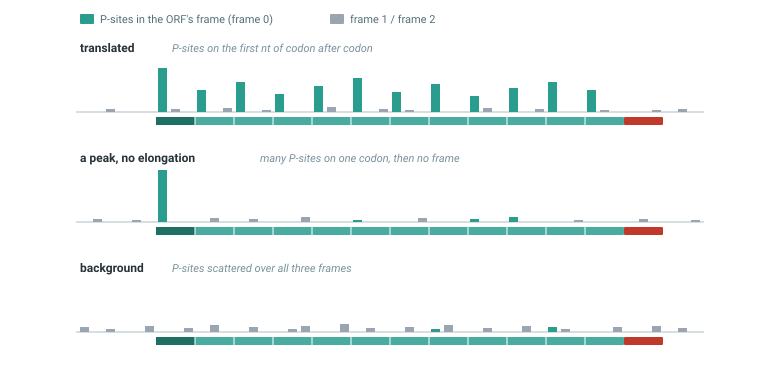
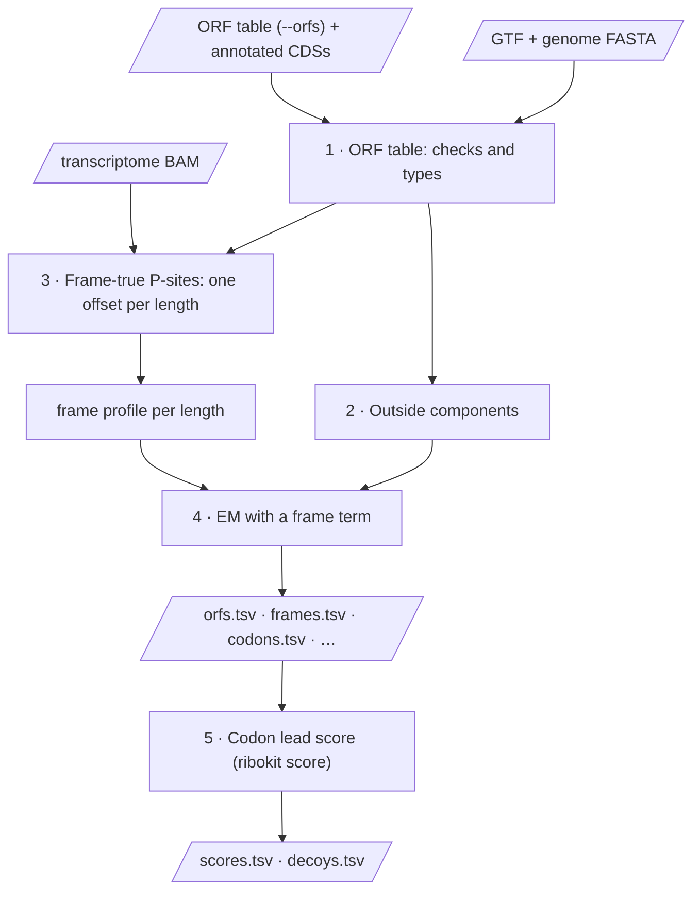
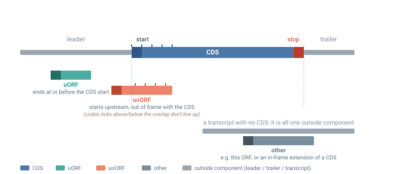
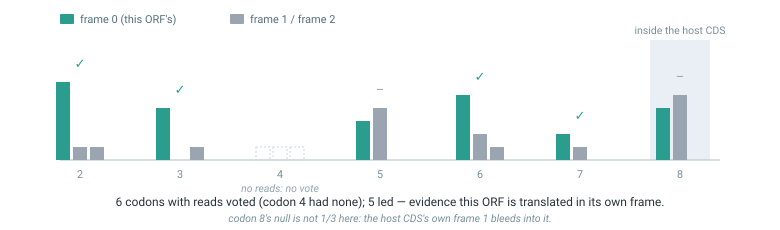

# ORF counting and frame scores

`ribokit orfs` and `ribokit score` count reads on ORFs other than the
annotated CDS — upstream ORFs (uORFs), ORFs overlapping the CDS out of frame
(uoORFs), and others — and turn those counts into evidence of translation.
Where `quant` only has to decide *which* CDS a read belongs to, these commands
also have to decide *whether* a read's reading frame agrees with the ORF it
sits on, since a footprint can overlap an ORF's span without ever being made
by a ribosome reading it.

## Background

**uORFs and uoORFs.** An upstream ORF (uORF) starts in a transcript's 5′
leader; about half of human and mouse transcripts have at least one
([Calvo et al. 2009](#references)). Ribosomes scan the leader from the 5′ end
and start at the first suitable start codon, so a ribosome that translates a
uORF reaches the CDS only if it resumes scanning after the uORF's stop and
starts again (reinitiates). Many do not, and uORF translation usually
represses the CDS ([Calvo et al. 2009; Johnstone et al. 2016; Hinnebusch et
al. 2016](#references)). A uORF that ends inside the CDS, out of frame with it
— an upstream overlapping ORF, or **uoORF** — goes further: its ribosomes pass
the CDS start codon, so they cannot start the CDS. ATF4 shows how cells use
this. Ribosomes that leave its short uORF1 normally reinitiate at uORF2, a
uoORF, and miss the ATF4 start; under stress, phosphorylation of eIF2 delays
reinitiation, and ribosomes scan past uORF2's start to reinitiate at the CDS
([Vattem and Wek 2004](#references)). The share of ribosomes on a uORF, against
its CDS, is thus a quantity of interest in its own right, and it can change
between conditions.

**Start codons and other ORFs.** Many uORFs start on a near-cognate codon —
CUG, GUG or UUG — rather than AUG ([Ingolia et al. 2009, 2011](#references)),
so ribokit takes start codons as given and does not check them. Besides
uORFs and uoORFs, a catalogue can hold ORFs on transcripts with no annotated
CDS, ORFs downstream of or inside the CDS, and in-frame N-terminal extensions
of it; ribokit types all of these `other` ([step 1](#1-the-orf-table)).

**Ribo-seq and the reading frame.** Ribosome profiling (Ribo-seq) sequences
the stretch of mRNA, about 30 nt, that each ribosome protects from nuclease:
its footprint ([Ingolia et al. 2009](#references)). A footprint's P-site, found
from its 5′ end and a length-dependent offset
([Method, step 3](method.md#3-p-site-offsets)), is the first nt of the codon
the ribosome is reading, and a translating ribosome moves one codon, 3 nt, at
a time. Thus the P-sites of a translated ORF fall in that ORF's frame, codon
after codon: a 3-nt periodicity, which is the signal that ORF callers test
([Calviello et al. 2016; Erhard et al. 2018; Xiao et al. 2018](#references)).

**Reads in an ORF's span are not enough.** Not every footprint inside a short
ORF comes from a ribosome translating it. Ribosomes that start or pause at one
codon without going on make a peak; an ORF that overlaps a CDS collects the
CDS's footprints, mostly in the CDS's frame; and the leader carries a
background of reads with no frame. Only P-sites in the ORF's own frame, over
many of its codons, show that ribosomes elongate through it.

<figure markdown="span">
  
  <figcaption>P-sites per nt on one ORF (made-up counts). <b>Translated</b>: P-sites on the
  first nt of codon after codon — the ORF's frame. <b>A peak, no elongation</b>: ribosomes
  start or stall on one codon and do not go on in this frame. <b>Background</b>: reads with no
  frame. A count of the reads in the span cannot tell these apart; the frame can.</figcaption>
</figure>

A real case, from libraries of a human cell line: one CUG in GAPDH's leader
holds as many P-sites as GAPDH's AUG start codon, so a span count makes the
ORF that starts at this CUG look well translated. But only 1-2% of the reads
after the CUG are in that ORF's frame — the rest follow GAPDH's CDS, which the
ORF overlaps — and harringtonine, which holds ribosomes at start codons
([Ingolia et al. 2011](#references)), raises the AUG peak but not the CUG's:
with it, the AUG has 11-19x the CUG's P-sites, without it about as many
([A peak is not a uORF](#a-peak-is-not-a-uorf)).

**What ribokit does and does not do.** ribokit does not find ORFs. It takes a
catalogue (`--orfs`) — from an ORF caller such as RiboTaper
([Calviello et al. 2016](#references)), PRICE
([Erhard et al. 2018](#references)), RiboCode ([Xiao et al. 2018](#references)),
ORFquant ([Calviello et al. 2020](#references)) or RiboTIE
([Clauwaert et al. 2025](#references)), or from a scan for start codons — and
for every ORF in it counts the reads with their frame (`orfs`) and scores the
frame evidence, pooled over libraries (`score`). It does not test where
ribosomes start: start sites need Ribo-seq with an initiation inhibitor, such
as harringtonine ([Ingolia et al. 2011](#references)) or lactimidomycin
([Lee et al. 2012](#references)), which ribokit does not use. A call says that
ribosomes elongate in the ORF's frame, not that they start at its start codon.

## At a glance



| Problem | What ribokit does |
|---|---|
| A footprint's P-site offset depends on its length and phase; snapping every phase onto the CDS (as `quant` does) erases any other reading frame a read might be in. | Uses one offset per read length (the untrimmed phase), so every P-site keeps the frame it was sequenced in ([step 3](#3-frame-true-p-sites-and-the-frame-profile)). |
| A footprint that merely overlaps an ORF's span was not necessarily made by a ribosome translating it. | Counts a codon as evidence only if ribosomes keep landing in that ORF's own reading frame ([step 5](#5-the-codon-lead-score)). |
| ORFs overlap: a uORF can sit over a CDS's start out of frame; several candidates can share a stop. | Splits shared reads by an EM with a frame term, so reads go by frame as well as by density, not to whichever ORF is denser ([step 4](#4-em-with-a-frame-term)). |
| Short ORFs, and ORFs with few reads, cannot tell translated from not. | Reports `min_p`: the best score the ORF's length and read depth could ever reach, next to its actual score ([Reading the results](#reading-the-results)). |
| A host CDS's own off-frame "noise" can look like translation in an ORF that overlaps it. | The null mixes in the host CDS's own frame profile where they overlap, instead of assuming an even 1/3 ([step 5](#5-the-codon-lead-score)). |

## 1. The ORF table

`--orfs` is the catalogue of ORFs to count; ribokit does not find ORFs
([Background](#background)). It is a TSV with `ORF_id Name start end`, in
the same transcript-coordinate convention as the annotated CDS (`start` =
first nt of the start codon, `end` = one past the last sense codon; the stop
codon is never included). The annotated CDSs are added under
`<transcript>:CDS` unless the table already lists the same span: such a row
is that CDS, so it gets type `CDS` and keeps its own `ORF_id`, and like
every annotated CDS it is not scored.

A row is dropped (and counted in `stats.tsv`) if its transcript is not in the
GTF, its length is not a positive multiple of 3, it runs off the transcript, or
no stop codon follows it. The start codon itself is **not** checked — non-ATG
starts, and starts made by a variant, are kept as given. The stop codon is
read from the genome FASTA, so a stop made by a variant counts as no stop
([Known limits](#known-limits)).

Each ORF's `type` comes from its coordinates against that transcript's
annotated CDS:

<figure markdown="span">
  
  <figcaption><b>uORF</b>: ends at or before the CDS start, in any frame. <b>uoORF</b>: starts
  upstream of the CDS and is out of frame with it. <b>other</b>: anything else, including an ORF on
  a transcript with no annotated CDS, or an in-frame N-terminal extension of one. Positions in no
  ORF form the <b>outside components</b> (gray): leader, trailer, or the whole transcript.</figcaption>
</figure>

Rows can share a stop: each longer one is then an in-frame N-terminal
extension of the shorter. These nested ORFs keep their own rows, and the EM
splits the reads they share ([Known limits](#known-limits)).

## 2. Outside components

Every position of a transcript that is in no ORF belongs to exactly one
**outside component**, so every read with a P-site is counted somewhere:
`<transcript>:leader` (5′ of the annotated CDS), `<transcript>:trailer` (3′ of
it, its stop codon included), or `<transcript>:transcript` if it has no
annotated CDS at all. Empty components (no free positions) are left out.
Outside components carry no frame term ([step 4](#4-em-with-a-frame-term)).

They exist because a read can fit the CDS of one transcript and the UTR of
another, or a transcript without a CDS, such as a pseudogene. Without outside
components such a read has only the CDS to go to and counts for it in full.
With them, the CDS and the outside component compete by density, as two CDSs
do in `quant`. In the [worked example](#worked-example), P1 is a transcript
without a CDS that holds 240 nt of U1's CDS, and 2,919 reads fit both:
`quant` gives U1's CDS 6,090 reads, against 5,984 drawn from it; `orfs` gives
it 6,010, and P1 127, against 153. This is also why `orfs`' CDS counts differ a
little from `quant`'s; for CDS counts, use `quant`
([Typical workflow](#typical-workflow)). A leader's `NumReads` over its
`Length` is the read density around its transcript's uORFs, e.g. a reference
for them.

Only transcripts of the GTF are counted. Alignments to BAM references that are
not in the GTF are dropped before any other step, so the run is the same as on
a BAM without those references: a read that also aligns to a GTF transcript
counts there, a read with no other alignment is lost. To leave transcripts out
of a run, leave them out of the GTF. `stats.tsv` counts what was dropped
(`refs_not_in_gtf`, `alignments_dropped_ref_not_in_gtf`,
`reads_dropped_ref_not_in_gtf`).

## 3. Frame-true P-sites and the frame profile

`quant`'s offsets snap every alignment onto a codon of its CDS, by design
([Method, step 3](method.md#3-p-site-offsets)): that is right for counting a
CDS, but it throws away any other reading frame a read might carry. Here each
read length instead gets **one** offset: the *phase-0* offset of `quant`'s
window, i.e. the offset of the untrimmed phase (a multiple of 3, and the
largest phase at almost every length). The P-site is 5′ end + this offset, on
every GTF transcript the read aligns to, UTRs and transcripts without a CDS
included ([step 2](#2-outside-components)). A read length without offsets has
no P-sites, so its reads are not counted, as in `quant`. Nor is an alignment
whose P-site lands past its transcript's end, which a long 3′ soft clip can
cause (`alignments_psite_off_transcript` in `stats.tsv`).

**Where off-frame reads come from.** Footprints of one length do not all start
on the same nucleotide of a codon: trimming leaves a nucleotide more or less
at the 5′ end, and the opposite at the 3′ end (the phases of
[Method, step 3](method.md#offsets-phases-and-the-codon-frame)). With one
offset per length, a CDS footprint trimmed one nucleotide more at the 5′ end
(phase 1) puts its P-site one nucleotide downstream, in frame 1 of the CDS;
one trimmed a nucleotide less (phase 2) puts it one nucleotide upstream, in
frame 2. `quant` gives each phase its own offset and so moves these P-sites
back to frame 0; `orfs` leaves them where they fall. Thus even a CDS,
translated in frame 0 only, has reads in its frames 1 and 2. In 6 human
libraries, 90-95% of the 27-28 nt reads inside CDSs were in frame 0, but
only 41-81% at the other lengths of 18-30 nt.

How often a read length's P-sites, placed this way, land in frame 0/1/2 of a
CDS is that length's **frame profile**, $\pi_l(f)$. It is measured from reads
at least 15 nt inside a CDS at both ends (no start or stop peaks), weighted
1/(number of alignments), over every annotated CDS, and written to
`frames.tsv`: `length offset reads frame0 frame1 frame2`. The EM
([step 4](#4-em-with-a-frame-term)) and the score's null
([step 5](#5-the-codon-lead-score)) use these shares with one pseudo-read per
frame, $\pi_l(f) = (n_f + 1)/(n + 3)$ for $n$ interior reads: no frame then
has probability 0, and a length without interior reads gets 1/3 in each frame,
i.e. no frame information.

Frames in `frames.tsv` are the CDS's. In `codons.tsv` and in the score they
are the ORF's own, counted from its start codon, so frame 0 is the ORF's
reading frame. For a uoORF in frame 1 of its CDS, the CDS's frame-0 reads
are in the uoORF's frame 2.

!!! tip "Reusing offsets"
    As with `quant`, `--offsets <prefix>.offsets.tsv` reuses another run's
    table. Comparisons across libraries should use one shared table, since the
    phase-0 offset of the shorter read lengths can otherwise differ between
    libraries ([Typical workflow](#typical-workflow)).

## 4. EM with a frame term

Reads are assigned to components — ORFs and outside components — by
equivalence class and split by EM, exactly as in `quant`
([Method, steps 5–6](method.md#5-equivalence-classes)), but with a frame term
in the model. For a P-site in ORF $k$'s codons, with $\phi = (\text{P-site} -
\texttt{start}_k) \bmod 3$:

$$
P(\text{read} \mid k) = \frac{3\,\pi_{l}(\phi)}{L_k}, \qquad
P(\text{read} \mid \text{outside component}) = \frac{1}{L}
$$

The factor of 3 gives the frame term a mean of 1 over the three frames,
$\tfrac{1}{3}\sum_f 3\,\pi_l(f) = 1$, so a read length with no frame
information ($\pi_l$ flat at 1/3) reduces to `quant`'s plain $1/L_k$. When
every component a read is compatible with is an ORF that puts it in the same
frame, the frame terms cancel and this is exactly `quant`'s model: nested ORFs
split their shared reads by density alone ([Known limits](#known-limits)).
The term matters where ORFs disagree on frame, e.g. a uoORF sharing reads
with its host CDS, and against outside components, which have no frame
term: there a read in an ORF's frame 0 leans toward the ORF, an off-frame
read toward the outside component. Components that no read's frame or
density tells apart are listed in `ties.tsv`, as in `quant`.

A numeric example: a read length with $\pi_l = (0.9, 0.07, 0.03)$, and a
uoORF in frame 1 of its CDS, at the same density as the CDS. A read in the
CDS's frame 0 is in the uoORF's frame 2: its weights are $3 \cdot 0.9 = 2.7$
for the CDS and $3 \cdot 0.03 = 0.09$ for the uoORF, so the uoORF gets 3% of
it. A read in the uoORF's frame 0 is in the CDS's frame 1: 2.7 for the uoORF
and 0.21 for the CDS, so the uoORF gets 93%. To take a read in the CDS's
frame 0, the uoORF has to be much denser: at 10 times the CDS's density it
gets 25%.

## 5. The codon lead score

`ribokit orfs` writes `codons.tsv`: P-sites per codon of every ORF but the
annotated CDSs (the annotated CDSs are assumed translated), by length and
frame. `ribokit score` sums the `codons.tsv` of one or more `orfs` runs — e.g.
replicate libraries — and scores the pool, so per-library scores are calls
with one `--orfs-prefix`. The runs must share one ORF table: if their
`orfs.tsv` list different ORFs, `score` stops with an error.

<figure markdown="span">
  
  <figcaption>Every codon but the start codon casts one vote: it <b>leads</b> when more of its
  score-length P-sites are in the ORF's own frame than in either other frame. A codon with no reads
  does not vote. A peak is one codon, so it is one vote at most, however many reads it holds.
  Codons are numbered as in <code>codons.tsv</code>: codon 0, the start codon, is not shown.</figcaption>
</figure>

- **Why the start codon does not vote.** Ribosomes that initiate make a peak
  at the start codon whether or not they go on to elongate, as at GAPDH's CUG
  ([Background](#background)). The codons after it ask only whether
  ribosomes elongate in the ORF's frame.
- **Which lengths vote.** By default, the read lengths whose frame-0 share is
  at least 0.9 in *every* given library's `frames.tsv` (`--frame-lengths LO-HI`
  overrides this). Using the same lengths for every library in a comparison
  matters more than using every length. If no length passes in every library,
  `score` stops and asks for `--frame-lengths`; the lengths given must be
  inside every run's `--read-lengths`.
- **The null.** For a codon that is not translated, each of its 3 positions is
  weighted by its expected reads from the EM: the ORF's own density as a
  frame-less background, plus, inside the host CDS, the CDS's density times
  $3\,\pi_l(\text{that position's frame in the CDS})$ — the same frame term the
  EM uses. This gives the null frame probabilities $q$ per read length and
  library; a codon's $q$ mixes them, weighted by its reads of each. Outside any
  CDS overlap $q = (1/3, 1/3, 1/3)$, but inside one, the host CDS's own frame bleed
  raises or lowers the untranslated odds of a lead.
- **Why the ORF's own density is the background.** The null is "this ORF is
  not translated": its reads, at the density observed, then come from
  sources with no frame. Thus depth alone does not make a call; only the
  frames do.
- **The null inside a CDS, in numbers.** A uoORF in frame 1 of its CDS, a
  read length with $\pi_l = (0.9, 0.07, 0.03)$, and the uoORF as dense as the
  CDS ($d$). The uoORF's frames 0, 1, 2 are the CDS's frames 1, 2, 0, so they
  get $d(1 + 3 \cdot 0.07) = 1.21d$, $d(1 + 3 \cdot 0.03) = 1.09d$ and
  $d(1 + 3 \cdot 0.9) = 3.7d$: $q = (0.20, 0.18, 0.62)$. A lead in the
  uoORF's frame then has a null probability of 0.20, not 1/3, so it is
  stronger evidence than outside the CDS.
- **One vote per codon.** A codon's reads do not arrive independently — two
  footprints of a codon share a nucleotide far more often than independent
  draws would — so treating them as a multinomial sample is anti-conservative.
  Each codon's lead probability $p_i$ is instead the *larger* of two
  extremes: $q_0$ (all of the codon's reads count as a single clump) and the
  exact multinomial probability for its read count (independent reads). This
  is conservative outside a CDS overlap (where $q_0 = 1/3$) and only differs
  from it where the ORF's frame is also the host CDS's dominant frame. In 6
  human libraries, at codons with 2 reads, both reads were in one frame in
  80% of the leader codons and 75% of the trailer codons, against 33% for
  independent reads; reads with one alignment clumped as much or more. So in
  leaders, a codon with 2 reads led in a given frame about 0.27 of the time,
  not the multinomial's 1/9. The multinomial alone called 184 uORFs and
  uoORFs, one vote 97, all of them among the 184; the 87 calls lost had a
  median of 6 codons with votes and 2.2 reads per codon. Synthetic reads do
  not clump, so on synthetic data one vote is conservative: U2's and U3's
  uoORFs are not called ([worked example](#worked-example)).
- **The statistic.** With $\text{leads} = \sum_i \mathbb{1}[\text{codon } i
  \text{ leads}]$:
  $$
  z = \frac{\text{leads} - \sum_i p_i}{\sqrt{\sum_i p_i(1 - p_i)}}
  $$
  `p` is the exact Poisson-binomial upper tail of $\text{leads}$ given the
  $p_i$ (not a normal approximation); `q` is Benjamini-Hochberg over the ORFs
  scored. `min_p` is the smallest `p` the ORF could reach if every codon that
  has reads had led — how far its length and depth let it go, regardless of
  what was actually observed. A short ORF, or one with few reads, can have a
  large `min_p` even when every vote it got was a lead.
- **Decoys.** Each ORF shifted by +1 and +2 nt, scored the same way with the
  ORF's own density as background, for null calibration. A shifted copy that
  overlaps the host CDS in the CDS's own frame is left out, since there it
  would read the CDS's translated codons. Every uoORF loses exactly one of its
  two copies this way (the shift that puts it in the CDS's frame), as does an
  out-of-frame ORF inside a CDS; a uORF's copies never do.

## 6. Outputs

Each file is written as `<prefix>.<name>`:

| File | Content |
|---|---|
| `orfs.tsv` | `ORF_id Name type start end start_codon Length NumReads`, one row per ORF and outside component, sorted by `Name`, `start`, `end`. `NA` where no read is compatible. For an outside component, `type` is `leader`, `trailer` or `transcript`, `start`–`end` is its whole region, `Length` counts only its positions in no ORF (the length the EM uses), and `start_codon` is `NA`. |
| `offsets.tsv` | The same table as `quant`'s ([Method, step 3](method.md#3-p-site-offsets)): on the same BAM and read lengths, the two commands give the same offsets, and either one's `--offsets` accepts it. `orfs` uses only each length's phase-0 offset. |
| `frames.tsv` | Per read length: `offset` (the phase-0 offset), `reads`, `frame0 frame1 frame2`. |
| `codons.tsv` | `ORF_id codon length frame0 frame1 frame2`: P-sites per codon, length and frame, for every ORF but the annotated CDSs — `score`'s input. `codon` counts from 0, the start codon, up to and including the stop codon, which the decoys reach into. Frames are relative to the ORF's start, not to the CDS as in `frames.tsv`. Only codons and lengths with P-sites have a row. Each alignment counts 1: a read that aligns to several transcripts counts once on each, not 1/(number of alignments). |
| `ties.tsv`, `stats.tsv` | As for `quant`, but over every ORF and outside component. |
| `psites.tsv` | `read Name psite length`, one row per alignment with a P-site — every alignment in the length window on a GTF transcript, not only those assigned to a CDS. |
| `scores.tsv` | One row per scored ORF: `ORF_id Name type start end codons codons_with_reads reads in_frame_share leads expected z p min_p q`. |
| `decoys.tsv` | The same columns plus `shift` (1 or 2 nt), without `q`. `ORF_id`, `Name` and `type` are the original ORF's; `start` and `end` are the shifted copy's. |
| `score_stats.tsv` | `libraries`, `frame_lengths` (the score lengths), `orfs_scored`, `decoys_scored`, and `decoys_left_out_cds_frame` (the shifted copies left out in the CDS's frame, see [Decoys](#5-the-codon-lead-score)). |

The columns of `scores.tsv`:

- `codons`: the voting codons, i.e. the ORF's codons without its start codon
  (the stop codon is never part of an ORF).
- `codons_with_reads`: the voting codons with at least one P-site of the score
  lengths. These are the votes.
- `reads`: those P-sites, summed over the libraries.
- `in_frame_share`: the share of `reads` in the ORF's frame; `NA` without
  reads.
- `leads`: the votes that lead. `expected`: $\sum_i p_i$, the leads expected
  under the null.
- `z`, `p`, `min_p`: as in [step 5](#5-the-codon-lead-score). An ORF without
  votes has `z` = `NA`, `p` = 1 and `min_p` = 1.
- `q`: Benjamini-Hochberg over every row, ORFs without votes included.

## Reading the results

A cut on `q`, e.g. 0.05, gives the calls. Benjamini-Hochberg turns it into a
**p cut**: the largest `p` among the ORFs with `q` below the q cut. (If no ORF
is called, the p cut that a single call would need is the q cut divided by
`orfs_scored`.) With the p cut, `min_p` sorts every ORF into one of three
groups:

| Group | Rule | Meaning |
|---|---|---|
| called | `q` below the q cut | Ribosomes elongate in the ORF's frame. |
| not called | `p` above the p cut, `min_p` at or below it | The ORF had enough votes to pass, but too few of them led. |
| cannot be called | `min_p` above the p cut | Too few codons with reads: the ORF would not pass even if every one led. |

**"Not called" does not mean "not translated".** Translated codons lead
nearly every time they have reads: 0.89-0.96 of them in CDS windows downsampled
to uORF depth (real data, 6 human libraries). What limits the calls is how many
codons have reads. With a median of 2 score-length reads per uORF, 1,472 of a
catalogue of 1,683 uORFs (87%) could not be called in those 6 libraries; with a
median of 12, in a pool of 15 libraries, 967 (57%). Report all three groups,
not "called" against the rest.

**The best `p` an ORF can reach.** Outside a CDS overlap every vote has
$p_i = 1/3$, so `min_p` is $3^{-k}$ for $k$ codons with reads. An ORF has at
most `codons` votes, one fewer than its codons:

| Codons with reads ($k$) | 3 | 4 | 5 | 6 | 9 |
|---|---:|---:|---:|---:|---:|
| `min_p` | 0.037 | 0.012 | 0.0041 | 0.0014 | 5.1e-5 |

At q < 0.05, the p cut was 0.0026 in the 6 libraries and 0.0092 in the 15:
6 and 5 votes, all leading. An ORF of 5 codons or fewer could not be called in
either, however deep the libraries. Reads clump, so $n$ reads cover fewer than
$n$ codons: in 15-codon CDS windows, 20 reads covered a median of 7 codons.
Inside a CDS overlap $q_0$ is not 1/3, and `min_p` is higher or lower.

**A call is about the frame, not the start.** It says that ribosomes elongate
in the ORF's frame over its voting codons, not where they start
([Background](#background)). Two ORFs that share a stop share a frame and the
codons of the shorter one, so the longer one can be called on those codons
alone: the score cannot tell which start ribosomes use.

**`leads` and `in_frame_share`.** `in_frame_share` counts reads; `leads` counts
codons. One peak in the ORF's frame can give a high in-frame share, but it is
one vote. The call uses only the leads; the in-frame share describes the ORF.

**`z` and `p`.** Call and rank by `p` or `q`: `p` is exact. `z` is the lead
excess in standard deviations, a scale to read, and with few votes its normal
tail is far from `p`. An ORF whose 5 votes all lead has `z` = 3.2 (normal tail
0.0008) but `p` = 0.0041.

**Decoys.** `decoys.tsv` checks the null on the data themselves. At the p cut,
the empirical FDR is (decoys with `p` at or below the cut / `decoys_scored`) /
(ORFs with `p` at or below the cut / `orfs_scored`), both totals from
`score_stats.tsv`. Decoys of translated ORFs are not null samples: only one
frame of a codon can lead, a translated ORF takes it, and its shifted copies
seldom lead. Thus the empirical FDR is conservative when many ORFs are
translated, and the decoys of the ORFs not called make the better null set. At
q < 0.05: 0 of 3,425 decoys passed the cut in the 6 libraries, 3 of 3,425 in
the 15 (empirical FDR 0.004).

**Pooling.** `score` sums the libraries before it scores them. A pool gives
more codons with reads, up to the ORF's `codons`, and a translated codon with
more reads leads more often, but no pool gives an ORF more votes than it has
codons. With 15 libraries instead of 6, uORF calls went from 66 to 310.

## Typical workflow

For a comparison of two conditions with several libraries each:

```bash
# one library without --offsets: its offsets.tsv becomes the shared table
ribokit orfs --bam ctrl_1.bam --gtf annotation.gtf --fasta genome.fa \
    --read-lengths 18-30 --orfs candidates.tsv --out-prefix out/ctrl_1
# every other library with the same GTF, ORF table and offsets
for s in ctrl_2 ctrl_3 treat_1 treat_2 treat_3; do
    ribokit orfs --bam $s.bam --gtf annotation.gtf --fasta genome.fa \
        --read-lengths 18-30 --orfs candidates.tsv \
        --offsets out/ctrl_1.offsets.tsv --out-prefix out/$s
done
# one score over every library, both conditions
ribokit score --orfs-prefix out/ctrl_{1,2,3} out/treat_{1,2,3} --out-prefix out/all
```

1. **One GTF, one ORF table and one offsets table for every library.**
   `score` needs the same ORF rows in every run, and the annotated CDSs come
   from the GTF. To leave transcripts out of some libraries only, remove their
   alignments from those libraries' BAMs, not the transcripts from the GTF:
   the other transcripts get the same counts either way
   ([step 2](#2-outside-components)), and the ORF rows stay the same. The
   phase-0 offset of short read lengths can differ between libraries (from 3
   to 12 nt at 18-24 nt, in 6 libraries of one experiment). Different
   offsets move reads across the ends of short ORFs differently in each
   library: a difference between conditions that is not biological. Take the
   table from one library, e.g. the deepest, as above.
2. **Check each library's `frames.tsv` and `stats.tsv`.** With a shared table,
   `offset` is the same in every library; `frame0` shows how sharp each
   length's frame is. By default `score` uses the lengths with `frame0` at
   least 0.9 in every library, so one library with a weaker frame can leave
   no length; `score` then stops, and `--frame-lengths` gives the lengths
   that are sharpest in all libraries. `stats.tsv` counts what each step
   dropped.
3. **Score once, over every library of the comparison, both conditions.**
   The calls then do not depend on the condition labels. Scoring one
   condition and testing its calls between conditions would favour ORFs with
   more reads in that condition. A larger pool also gives more calls
   ([Reading the results](#reading-the-results)).
4. **Counts for the tests.** `NumReads` in each library's `orfs.tsv` are the
   counts for a differential test between conditions, e.g. of a uORF's reads
   relative to its CDS's. They count every read length in `--read-lengths`
   that has an offset, not only the score lengths. `scores.tsv` sorts the
   ORFs into called, not called and cannot be called
   ([Reading the results](#reading-the-results));
   sum nested ORFs first ([Known limits](#known-limits)).
5. **CDS counts.** `orfs.tsv` has the annotated CDSs too, but by design their
   counts differ a little from `quant`'s: outside components and the frame
   term move some reads between a CDS and the components around it. In 6
   human libraries, for CDSs with at least 10 reads, the median
   log2(`orfs` / `quant`) was 0, the 99th percentile of its absolute value
   0.12-0.16, and the totals were 0.4-0.7% lower. For CDS quantification, use
   `quant`.

On human libraries, `orfs` took 24-132 s and at most 3.4 GB per library,
and `score` 10-25 s and 0.2-0.3 GB for 6-15 libraries.

## Known limits

- **Nested ORFs.** ORFs with the same stop (the same `Name` and `end`) are in
  the same frame: each longer one is an in-frame N-terminal extension of the
  shorter. On their shared codons the frame terms cancel
  ([step 4](#4-em-with-a-frame-term)), so the EM splits the shared reads by
  density alone, and often one ORF of the group gets all of them. The score
  can call the longer ORF on the shared codons alone
  ([Reading the results](#reading-the-results)). Sum the counts of a group, or
  report it as one unit. In a real catalogue of 1,741 ORFs from an ORF caller,
  310 ORFs are in 148 such groups; against a count that gives the shared reads
  to every ORF of a group, the nested uORFs kept 0.53 of their reads, the
  other uORFs 0.94.
- **A CDS start peak spills into an overlapping uoORF.** Reads of the CDS's
  start-codon peak that put their P-site 1-2 nt upstream of the start codon
  land in the uoORF's part upstream of the CDS, where the uoORF is the only
  component. The EM counts them for the uoORF, and the frame term returns only
  some of them ([worked example](#worked-example), U4). The score gives the
  peak one vote, so it does not call such a uoORF, but its count holds part of
  the peak.
- **Inside a CDS, the null is anti-conservative in the far tail.** The null
  uses the frame profile of all CDSs ([step 5](#5-the-codon-lead-score)), and
  CDSs differ in how many of their reads fall in their off-frames. This
  concerns uoORFs and other ORFs inside a CDS, at small `p`. On real data, in
  10-codon windows in the off-frames of CDSs, p ≤ 0.001 came up 5-6x as often
  as expected (p ≤ 0.05: 1.3-1.4x). Each CDS's own frame profile would halve
  the excess at p ≤ 0.001; part of the rest can be translation in the
  off-frames.
- **uoORFs that stop after the CDS stop.** A uoORF starts upstream of the CDS,
  out of frame, and ends in the CDS or after it
  ([step 1](#1-the-orf-table)). One that ends after the CDS stop contains the
  whole CDS, which is often a sign that the annotated CDS stops too early.
  Find them by their `end` against the `end` of their transcript's CDS row in
  `orfs.tsv`, and check them before a uORF analysis. In a real catalogue, 2 of
  59 uoORFs stop after the CDS stop, both on transcripts whose annotated CDS
  stops early.
- **Starts and stops made by a variant.** The start codon is not checked
  ([step 1](#1-the-orf-table)), so an ORF whose start codon comes from a
  variant in the sample is kept. The stop codon is checked against the genome
  FASTA, so an ORF whose stop codon comes from a variant is dropped
  (`orfs_dropped_no_stop` in `stats.tsv`).
- **Short ORFs.** Outside a CDS overlap, an ORF of 5 codons or fewer has at
  most 4 votes, so its `min_p` is at least 0.012: it cannot reach p < 0.01 at
  any depth ([Reading the results](#reading-the-results)).
- **Transcript ends.** A P-site is seen only if its whole footprint lies on
  the transcript, so a transcript's first nt, up to the offset, and its last
  few codons get fewer P-sites than its middle. The EM uses each component's
  full length, so a leader, a trailer or an ORF near a transcript end gets a
  density a little too low.

## Worked example

ribokit's ORF tests (`tests/synth.py`, `make_orf_dataset`) build five
transcripts with CDSs, each carrying ORFs that exercise one design decision:

- **U1**: a 21-codon ATG uORF with its own reads, an untranslated 16-codon ATG
  candidate with none, and an 11-codon CTG ORF with reads on its start codon
  only (a peak, not a translated ORF) — all upstream of U1's CDS.
- **U2** and **U3**: a translated 50-codon uoORF overlapping their CDS's start,
  in frame 1 and frame 2 respectively.
- **U4**: the same arrangement as U2, but the uoORF itself is **not**
  translated — only its host CDS's start-codon peak is.
- **U5**: a translated 80-codon uoORF with a longer run upstream of the CDS.
- **N1**: a 26-codon translated ORF on a transcript with no annotated CDS
  ("other").
- **P1**: a transcript with no CDS that happens to share 240 nt of sequence
  with U1's CDS (pseudogene-like).

**Counts** (`ribokit orfs`, truth vs. `NumReads`):

| ORF | type | truth | got |
|---|---|---:|---:|
| U1's uORF | uORF | 396 | 396.0 |
| U1's CTG peak | uORF | 93 | 93.0 |
| U1's untranslated candidate | uORF | — (no reads) | `NA` |
| U1's CDS | CDS | 5,984 | 6,009.6 |
| N1's ORF | other | 297 | 298.0 |

The uoORF/CDS pairs split their shared reads by frame as well as by density:
U2's uoORF and its CDS recover their combined truth within 0.3%, and their
share of it within 2 percentage points; U3's (frame 2) do the same. U4's
untranslated uoORF is not free of reads, though. Its CDS's start-codon peak
holds footprints 1-2 nt long at the 5′ end, which put their P-site 1-2 nt
upstream of the CDS start: in the uoORF's leader part, where the uoORF is the
only component. With that density, the EM takes the uoORF for translated and
gives it a share of the overlap as well — 129 reads in all by density alone.
The frame term returns about a quarter of them to the CDS, leaving 99, but not
the rest: the peak reads have nowhere else to go, and the CDS's reads in its
frame 1 are in the uoORF's frame 0. This is a known limit of the model, not a
bug; the score below still does not call U4's uoORF.

**Scores** (`ribokit score`, pooled over one library, with background reads
also landing inside every ORF span — a harder setting than the counts example
above, needed to check that an untranslated candidate does not get a free
pass). The synthetic reads have a weak frame — frame-0 shares of 0.48-0.67 at
28-30 nt, below the default 0.9 — so the run gives `--frame-lengths 28-30`:

| ORF | type | voting codons | reads | leads | expected | q | called? |
|---|---|---:|---:|---:|---:|---:|---|
| U1's uORF | uORF | 20 | 389 | 19 | 6.7 | 9.4e-8 | yes |
| N1's ORF | other | 25 | 303 | 20 | 8.3 | 9.1e-6 | yes |
| U5's uoORF | uoORF | 79 | 1,145 | 40 | 23.2 | 1.3e-4 | yes |
| U1's untranslated candidate | uORF | 15 | 15 | 0 | 2.7 | 1.0 | no |
| U1's CTG peak | uORF | 10 | 16 | 2 | 2.7 | 1.0 | no |
| U4's uoORF (untranslated) | uoORF | 49 | 616 | 5 | 10.2 | 1.0 | no |
| U2's uoORF | uoORF | 49 | 772 | 17 | 12.9 | 0.19 | no |
| U3's uoORF | uoORF | 49 | 798 | 20 | 14.6 | 0.13 | no |

U1's uORF, N1's ORF and U5's uoORF are called; the untranslated candidate, the
CTG start-only peak and U4's uoORF are not. U2's and U3's uoORFs are
translated, and their `min_p` (the best `p` their 49 voting codons could reach
if every one led) is tiny — 1e-29 and 1e-26 — but their actual `p` is 0.12 and
0.065 (`q` 0.19 and 0.13): at this depth, with a host CDS that outvotes them, not enough of their
codons actually lead. `min_p` is how ribokit reports that gap between
"could be called" and "was called", instead of leaving it silent.

## Validation on real data

What `orfs` and `score` do on real Ribo-seq libraries, as numbers. The data
are not shipped with ribokit; the numbers come from its validation runs.

### The data

- **6 libraries** of a human cell line: 2 conditions × 3 replicates. Read
  lengths 18-30 nt; score lengths 27-28 nt, the only lengths with a frame-0
  share of at least 0.9 in every library.
- **15 libraries** of one condition of the same cell line, from 5
  experiments of 3 replicates each (3 of them are also among the 6).
- **6 harringtonine libraries**, one for each of the 6 libraries (same
  condition and replicate), for the start peaks.
- **The catalogue**: 1,741 ORFs that RiboTIE ([Clauwaert et al.
  2025](#references)) called in at least 3 of the 15 libraries: 1,683 uORFs
  and 58 uoORFs, with ATG starts 1,051, CTG 416, GTG 150 and TTG 124, and a
  median length of 30 nt. Added to it: the ORF that starts at GAPDH's CUG
  ([A peak is not a uORF](#a-peak-is-not-a-uorf)), a uoORF, so 59 uoORFs in
  all.

### Is the null calibrated?

Windows of 10 codons where no catalogue ORF is, scored as an ORF there would
be (6 libraries pooled, score lengths): in leaders, in trailers, and in the
two off-frames of CDSs. Observed / expected windows at two `p` cuts (for
leaders and trailers, the range over the three frames of a window), for
a null that takes a codon's reads as independent (multinomial) and for one
vote per codon ([step 5](#5-the-codon-lead-score)):

| Windows | Null | p ≤ 0.05 | p ≤ 0.001 |
|---|---|---:|---:|
| leaders | multinomial | 505-600 / 112-113 | 24-56 / 0.2 |
| | one vote | 312-353 / 101-104 | 12-26 / 0.1 |
| trailers | multinomial | 342-780 / 92-95 | 49-148 / 0.3 |
| | one vote | 215-599 / 89-90 | 20-57 / 0.1 |
| CDS frame +1 | multinomial | 20,119 / 3,923 | 3,117 / 59 |
| | one vote | 7,736 / 5,518 | 350 / 66 |
| CDS frame +2 | multinomial | 17,041 / 7,918 | 1,467 / 79 |
| | one vote | 9,272 / 6,962 | 473 / 79 |

One vote per codon removes much of the excess, but not all of it. Leaders
and trailers are not clean null sets: they hold translated ORFs that are not
in the catalogue, and trailers have a frame bias of unknown cause (at codons
with 1 read, 0.30 / 0.36 / 0.34 of the reads in the CDS's frames 0 / 1 / 2,
against 0.32 / 0.33 / 0.34 in leaders). This check cannot tell how much of
their excess is translation. In CDS off-frames, the null uses the frame
profile of all CDSs, and CDSs differ ([Known limits](#known-limits)).

The decoys say the opposite. Of the 2,258 decoys with votes, 11 had
p ≤ 0.05 (32.1 expected) and 1 had p ≤ 0.01 (2.8). In the 15 libraries, of
the 2,800 decoys with a null of 1/3 in every codon, 17 had p ≤ 0.05 (60.7),
3 had p ≤ 0.01 (7.1) and 1 had p ≤ 0.001 (0.5). Part of this is by
construction: a decoy of a translated ORF cannot lead
([Reading the results](#reading-the-results)). The decoys of the 184 ORFs
that the multinomial null called had none at p ≤ 0.05, against 9.7
expected. At the q < 0.05 cut, 0 of 3,425 decoys passed in the 6 libraries,
and 3 of 3,425 in the 15 (empirical FDR 0.004).

### Power at uORF depth

How many reads does a translated uORF need to be called? Windows of 6-50
codons in the reading frame of annotated CDSs, which are translated, were
cut to 5-320 reads by drawing reads without replacement (so the clumps
stay), and scored as uORFs against the p cut of the 6 libraries (0.0026).
The share of windows called:

| Codons \ reads | 5 | 10 | 20 | 40 | 80 | 160 | 320 |
|---|---:|---:|---:|---:|---:|---:|---:|
| 6 | 0 | 0.01 | 0.07 | 0.21 | 0.33 | 0.50 | 0.57 |
| 10 | 0 | 0.11 | 0.31 | 0.56 | 0.72 | 0.77 | 0.86 |
| 15 | 0 | 0.22 | 0.52 | 0.73 | 0.88 | 0.93 | 0.97 |
| 20 | 0 | 0.30 | 0.64 | 0.85 | 0.95 | 0.98 | 0.99 |
| 30 | 0 | 0.41 | 0.76 | 0.92 | 0.98 | 0.99 | 0.99 |
| 50 | 0 | 0.48 | 0.84 | 0.97 | 0.99 | 1.00 | 1.00 |

A 15-codon uORF needs about 20 reads to be called half the time; 80% needs
about 20 codons and 40 reads, or 15 codons and 80. At every size and depth,
0.89-0.96 of the codons with reads lead, so the limit is the number of
codons with reads: 20 reads cover a median of 7 of 15 codons, and 6 votes
that all lead are needed.

Applied to the catalogue, a uORF's **power** is the share of CDS windows
with its codons and reads that are called. 1,472 of the 1,683 uORFs cannot
be called at all (`min_p` above the cut), and if every uORF were translated
as CDSs are, 203 calls would be expected; 66 were made. Of the 100 uORFs
with a power of at least 0.8, 45 were called. The 55 others had
fewer leading codons (a median of 0.60 of the codons with reads, against
0.87) and a lower in-frame share (0.74 against 0.86).

### Calls and depth

The same catalogue, scored on the 6 libraries and on the 15 (both at 27-28
nt):

| | 6 libraries | 15 libraries |
|---|---:|---:|
| p cut (largest `p` with q < 0.05) | 0.0026 | 0.0092 |
| Votes needed, all leading | 6 | 5 |
| uORFs with no reads (of 1,683) | 510 | 220 |
| uORF reads, median | 2 | 12 |
| uORFs that cannot be called | 1,472 | 967 |
| uORFs called | 66 | 310 |
| uoORFs called (of 59) | 31 | 46 |
| Decoys at the cut (of 3,425) | 0 | 3 |
| Empirical FDR at the cut | 0 | 0.004 |

With 2.5 times the libraries, the score called 4.7 times the uORFs, and the
decoys stayed below the FDR. 91 of the 97 calls of the 6 libraries were also
calls of the 15; the other 6 had a median `q` of 0.10 there.

### Which read lengths

The frame-0 share per read length (`frames.tsv`), lowest and highest over
the 6 libraries:

| nt | 18 | 19 | 20 | 21 | 22 | 23 | 24 | 25 | 26 | 27 | 28 | 29 | 30 |
|---|---:|---:|---:|---:|---:|---:|---:|---:|---:|---:|---:|---:|---:|
| lowest | 0.41 | 0.61 | 0.64 | 0.68 | 0.58 | 0.65 | 0.67 | 0.48 | 0.71 | 0.90 | 0.93 | 0.69 | 0.46 |
| highest | 0.48 | 0.72 | 0.79 | 0.74 | 0.66 | 0.67 | 0.72 | 0.57 | 0.75 | 0.93 | 0.95 | 0.81 | 0.60 |

27-28 nt hold 59% of the reads in the 15 libraries. More score lengths add
reads, but not calls (15 libraries):

| Score lengths | uORF reads, median | uORF calls | uoORF calls | Calls lost / new against 27-28 | Decoys at the cut |
|---|---:|---:|---:|---:|---:|
| 27-28 | 12 | 310 | 46 | - | 3 |
| 26-28 | 17 | 305 | 44 | 45 / 38 | 3 |
| 26-29 | 18 | 317 | 44 | 43 / 48 | 3 |
| 24-29 | 21 | 319 | 46 | 47 / 56 | 3 |
| 18-30 | 24 | 306 | 45 | 69 / 64 | 5 |
| 28 | 6 | 197 | 44 | 129 / 14 | 3 |

The added reads go mostly to codons that already have reads: the median
number of votes per uORF goes from 4 to 5 at most. And they have a weaker
frame: in the called uORFs, the median share of leading codons goes from
0.86 to 0.80. Fewer lengths lose calls: without 27 nt, whose frame is
weaker in one of the 5 experiments (frame-0 share 0.79-0.81), 129 of the
356 calls are lost.

### Frame evidence is not start evidence

Harringtonine holds ribosomes at start codons. In the 6 harringtonine
libraries, the offsets of `orfs` put the start peak on nt 0 of annotated
start codons at 23-29 nt; at 27-28 nt, 52-62% of the P-sites from nt -15 to
+17 are on nt 0. A catalogue ORF has a **start peak** when its start codon
(± 1 codon) holds more harringtonine P-sites than expected: against the 30
nt on each side (local), or against the elongation libraries of the same
condition, as a larger share of the transcript's harringtonine P-sites than
of its elongation P-sites (elongation).

At the same power, called and not-called uORFs had start peaks equally
often (15-library calls, one condition):

| uORFs, power ≥ 0.8 | n | Start peak, local | Start peak, elongation |
|---|---:|---:|---:|
| called | 248 | 168 (68%) | 130 (52%) |
| not called | 243 | 171 (70%) | 122 (50%) |

Over all uORFs, start peaks were nearly as frequent as at annotated CDS
starts of the same depth. So most catalogue uORFs start as CDSs do, and about half of
those that start and have power have no frame that the score accepts. A call
says that ribosomes elongate in the ORF's frame, not that they start at its
start codon ([Background](#background)).

### A peak is not a uORF

GAPDH's leader has a CUG, made by a variant of this cell line, that holds
73-89% of the leader's P-sites. In the elongation libraries, nt 0 of the CUG
has as many P-sites as nt 0 of GAPDH's AUG start codon (514 and 510 in one
condition, 52 and 60 in the other).

- **Counts.** `orfs` counts the peak for the ORF that starts at the CUG: 842
  reads over the 6 libraries, 0.6-1.4% of GAPDH's CDS reads per library. A
  count alone makes this ORF look translated.
- **Frame.** Only 1.4% of the ORF's score-length P-sites are in its frame
  (2.4% in the 15 libraries); the rest follow GAPDH's CDS, which the ORF
  overlaps. `p` is 1 in the 6 libraries, `q` 0.77 in the 15: not called.
- **Start.** Harringtonine raises the AUG peak but not the CUG's: with it,
  the AUG has 11-19 times the CUG's P-sites (5,559 against 488, and 845
  against 44). So the CUG peak is not a usual start peak.

## Determinism

As for `quant`: no random numbers anywhere, ties go to the smallest tie-break,
and a rerun — of `orfs` or of `score` — gives byte-identical output. Pooling a
library with itself in `score` doubles `reads` and leaves `leads` unchanged.

## References

- Calviello L, Mukherjee N, Wyler E, Zauber H, Hirsekorn A, Selbach M,
  Landthaler M, Obermayer B, Ohler U (2016). Detecting actively translated open
  reading frames in ribosome profiling data. *Nature Methods* 13(2):165-170.
  [doi:10.1038/nmeth.3688](https://doi.org/10.1038/nmeth.3688)
- Calviello L, Hirsekorn A, Ohler U (2020). Quantification of translation
  uncovers the functions of the alternative transcriptome. *Nature Structural &
  Molecular Biology* 27(8):717-725.
  [doi:10.1038/s41594-020-0450-4](https://doi.org/10.1038/s41594-020-0450-4)
- Calvo SE, Pagliarini DJ, Mootha VK (2009). Upstream open reading frames cause
  widespread reduction of protein expression and are polymorphic among humans.
  *PNAS* 106(18):7507-7512.
  [doi:10.1073/pnas.0810916106](https://doi.org/10.1073/pnas.0810916106)
- Clauwaert J, McVey Z, Gupta R, Yannuzzi I, Basrur V, Nesvizhskii AI,
  Menschaert G, Prensner JR (2025). Deep learning to decode sites of RNA
  translation in normal and cancerous tissues. *Nature Communications*
  16:1275.
  [doi:10.1038/s41467-025-56543-0](https://doi.org/10.1038/s41467-025-56543-0)
- Erhard F, Halenius A, Zimmermann C, L'Hernault A, Kowalewski DJ, Weekes MP,
  Stevanovic S, Zimmer R, Dölken L (2018). Improved Ribo-seq enables
  identification of cryptic translation events. *Nature Methods*
  15(5):363-366. [doi:10.1038/nmeth.4631](https://doi.org/10.1038/nmeth.4631)
- Hinnebusch AG, Ivanov IP, Sonenberg N (2016). Translational control by
  5′-untranslated regions of eukaryotic mRNAs. *Science* 352(6292):1413-1416.
  [doi:10.1126/science.aad9868](https://doi.org/10.1126/science.aad9868)
- Ingolia NT, Ghaemmaghami S, Newman JRS, Weissman JS (2009). Genome-wide
  analysis in vivo of translation with nucleotide resolution using ribosome
  profiling. *Science* 324(5924):218-223.
  [doi:10.1126/science.1168978](https://doi.org/10.1126/science.1168978)
- Ingolia NT, Lareau LF, Weissman JS (2011). Ribosome profiling of mouse
  embryonic stem cells reveals the complexity and dynamics of mammalian
  proteomes. *Cell* 147(4):789-802.
  [doi:10.1016/j.cell.2011.10.002](https://doi.org/10.1016/j.cell.2011.10.002)
- Johnstone TG, Bazzini AA, Giraldez AJ (2016). Upstream ORFs are prevalent
  translational repressors in vertebrates. *EMBO Journal* 35(7):706-723.
  [doi:10.15252/embj.201592759](https://doi.org/10.15252/embj.201592759)
- Lee S, Liu B, Lee S, Huang SX, Shen B, Qian SB (2012). Global mapping of
  translation initiation sites in mammalian cells at single-nucleotide
  resolution. *PNAS* 109(37):E2424-E2432.
  [doi:10.1073/pnas.1207846109](https://doi.org/10.1073/pnas.1207846109)
- Vattem KM, Wek RC (2004). Reinitiation involving upstream ORFs regulates ATF4
  mRNA translation in mammalian cells. *PNAS* 101(31):11269-11274.
  [doi:10.1073/pnas.0400541101](https://doi.org/10.1073/pnas.0400541101)
- Xiao Z, Huang R, Xing X, Chen Y, Deng H, Yang X (2018). De novo annotation and
  characterization of the translatome with ribosome profiling data. *Nucleic
  Acids Research* 46(10):e61.
  [doi:10.1093/nar/gky179](https://doi.org/10.1093/nar/gky179)
