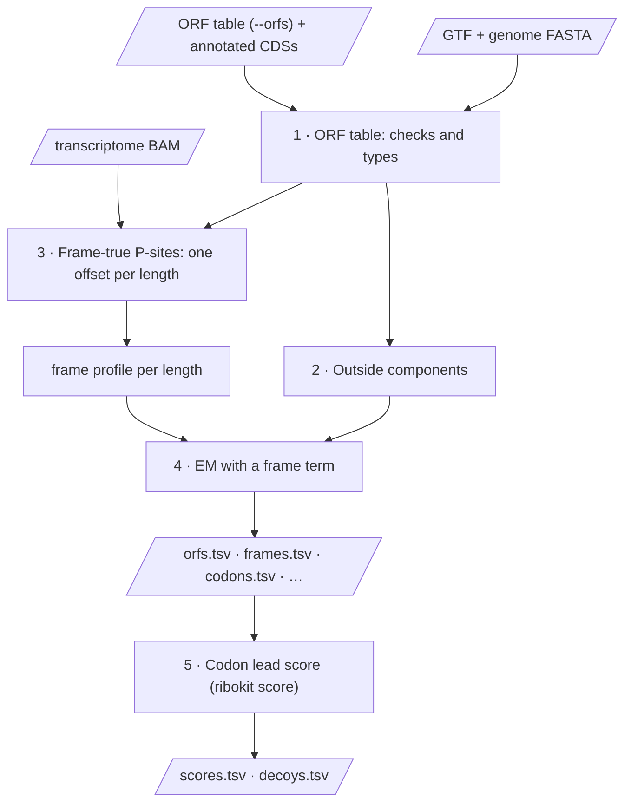

# ORF counting and frame scores

`ribokit orfs` and `ribokit score` count reads on ORFs other than the
annotated CDS — upstream ORFs (uORFs), ORFs overlapping the CDS out of frame
(uoORFs), and others — and turn those counts into evidence of translation.
Where `quant` only has to decide *which* CDS a read belongs to, these commands
also have to decide *whether* a read's reading frame agrees with the ORF it
sits on, since a footprint can overlap an ORF's span without ever being made
by a ribosome reading it.

## At a glance

| Problem | What ribokit does |
|---|---|
| A footprint's P-site offset depends on its length and phase; snapping every phase onto the CDS (as `quant` does) erases any other reading frame a read might be in. | Uses one offset per read length (the untrimmed phase), so every P-site keeps the frame it was sequenced in ([step 3](#3-frame-true-p-sites-and-the-frame-profile)). |
| A footprint that merely overlaps an ORF's span was not necessarily made by a ribosome translating it. | Counts a codon as evidence only if ribosomes keep landing in that ORF's own reading frame ([step 5](#5-the-codon-lead-score)). |
| ORFs overlap: a uORF can sit over a CDS's start out of frame; several candidates can share a stop. | Splits shared reads by an EM with a frame term, so reads go by frame as well as by density, not to whichever ORF is denser ([step 4](#4-em-with-a-frame-term)). |
| Short ORFs, and ORFs with few reads, cannot tell translated from not. | Reports `min_p`: the best score the ORF's length and read depth could ever reach, next to its actual score. |
| A host CDS's own off-frame "noise" can look like translation in an ORF that overlaps it. | The null mixes in the host CDS's own frame profile where they overlap, instead of assuming an even 1/3 ([step 5](#5-the-codon-lead-score)). |

## 1. The ORF table

`--orfs` is a TSV with `ORF_id Name start end`, in the same transcript-coordinate
convention as the annotated CDS (`start` = first nt of the start codon, `end` =
one past the last sense codon; the stop codon is never included). The annotated
CDSs are added under `<transcript>:CDS` unless the table already lists the same
span.

A row is dropped (and counted in `stats.tsv`) if its transcript is not in the
GTF, its length is not a positive multiple of 3, it runs off the transcript, or
no stop codon follows it. The start codon itself is **not** checked — non-ATG
starts, and starts made by a variant, are kept as given.

Each ORF's `type` comes from its coordinates against that transcript's
annotated CDS:

<figure markdown="span">
  
  <figcaption><b>uORF</b>: ends at or before the CDS start, in any frame. <b>uoORF</b>: starts
  upstream of the CDS and is out of frame with it. <b>other</b>: anything else, including an ORF on
  a transcript with no annotated CDS, or an in-frame N-terminal extension of one. Positions in no
  ORF form the <b>outside components</b> (gray): leader, trailer, or the whole transcript.</figcaption>
</figure>

## 2. Outside components

Every position of a transcript that is in no ORF belongs to exactly one
**outside component**, so every read with a P-site is counted somewhere:
`<transcript>:leader` (5′ of the annotated CDS), `<transcript>:trailer` (3′ of
it, its stop codon included), or `<transcript>:transcript` if it has no
annotated CDS at all. Empty components (no free positions) are left out.
Outside components carry no frame term ([step 4](#4-em-with-a-frame-term)).

## 3. Frame-true P-sites and the frame profile

`quant`'s offsets snap every alignment onto a codon of its CDS, by design
([Method, step 3](method.md#3-p-site-offsets)): that is right for counting a
CDS, but it throws away any other reading frame a read might carry. Here each
read length instead gets **one** offset: the *phase-0* offset of `quant`'s
window, i.e. the offset of the untrimmed phase (a multiple of 3, and the
largest phase at almost every length). The P-site is 5′ end + this offset, on
every BAM reference the read aligns to — UTRs, transcripts without a CDS, and
references missing from the GTF included.

How often a read length's P-sites, placed this way, land in frame 0/1/2 of a
CDS is that length's **frame profile**, $\pi_l(f)$. It is measured from reads
at least 15 nt inside a CDS at both ends (no start or stop peaks), weighted
1/(number of alignments), over every annotated CDS, and written to
`frames.tsv`: `length offset reads frame0 frame1 frame2`.

!!! tip "Reusing offsets"
    As with `quant`, `--offsets <prefix>.offsets.tsv` reuses another run's
    table. Comparisons across libraries should use one shared table, since the
    phase-0 offset of the shorter read lengths can otherwise differ between
    libraries.

## 4. EM with a frame term

Reads are assigned to components — ORFs and outside components — by
equivalence class and split by EM, exactly as in `quant`
([Method, steps 5–6](method.md#5-equivalence-classes)), but with a frame term
in the model. For a P-site in ORF $k$'s codons, with $\phi = (\text{P-site} -
\texttt{start}_k) \bmod 3$:

$$
P(\text{read} \mid k) = \frac{3\,\pi_{l}(\phi)}{L_k}, \qquad
P(\text{read} \mid \text{outside component}) = \frac{1}{L}
$$

The factor of 3 gives the frame term a mean of 1 over the three frames,
$\tfrac{1}{3}\sum_f 3\,\pi_l(f) = 1$, so a read length with no frame
information ($\pi_l$ flat at 1/3) reduces to `quant`'s plain $1/L_k$. When
every component a read is compatible with is an ORF that puts it in the same
frame, the frame terms cancel and this is exactly `quant`'s model. The term
matters where ORFs disagree on frame, e.g. a uoORF sharing reads with its host
CDS, and against outside components, which have no frame term: there a read in
an ORF's frame 0 leans toward the ORF, an off-frame read toward the outside
component. Components that no read's frame or density tells apart are listed
in `ties.tsv`, as in `quant`.

## 5. The codon lead score

`ribokit orfs` writes `codons.tsv`: P-sites per codon of every ORF but the
annotated CDSs (the annotated CDSs are assumed translated), by length and
frame. `ribokit score` sums the `codons.tsv` of one or more `orfs` runs — e.g.
replicate libraries — and scores the pool, so per-library scores are calls
with one `--orfs-prefix`. The runs must share one ORF table: if their
`orfs.tsv` list different ORFs, `score` stops with an error.

<figure markdown="span">
  
  <figcaption>Every codon but the start codon casts one vote: it <b>leads</b> when more of its
  score-length P-sites are in the ORF's own frame than in either other frame. A codon with no reads
  does not vote. A peak is one codon, so it is one vote at most, however many reads it holds.
  Codons are numbered as in <code>codons.tsv</code>: codon 0, the start codon, is not shown.</figcaption>
</figure>

- **Which lengths vote.** By default, the read lengths whose frame-0 share is
  at least 0.9 in *every* given library's `frames.tsv` (`--frame-lengths LO-HI`
  overrides this). Using the same lengths for every library in a comparison
  matters more than using every length. If no length passes in every library,
  `score` stops and asks for `--frame-lengths`; the lengths given must be
  inside every run's `--read-lengths`.
- **The null.** For a codon that is not translated, each of its 3 positions is
  weighted by its expected reads from the EM: the ORF's own density as a
  frame-less background, plus, inside the host CDS, the CDS's density times
  $3\,\pi_l(\text{that position's frame in the CDS})$ — the same frame term the
  EM uses. This gives the null frame probabilities $q$; outside any CDS
  overlap $q = (1/3, 1/3, 1/3)$, but inside one, the host CDS's own frame bleed
  raises or lowers the untranslated odds of a lead.
- **One vote per codon.** A codon's reads do not arrive independently — two
  footprints of a codon share a nucleotide far more often than independent
  draws would — so treating them as a multinomial sample is anti-conservative.
  Each codon's lead probability $p_i$ is instead the *larger* of two
  extremes: $q_0$ (all of the codon's reads count as a single clump) and the
  exact multinomial probability for its read count (independent reads). This
  is conservative outside a CDS overlap (where $q_0 = 1/3$) and only differs
  from it where the ORF's frame is also the host CDS's dominant frame.
- **The statistic.** With $\text{leads} = \sum_i \mathbb{1}[\text{codon } i
  \text{ leads}]$:
  $$
  z = \frac{\text{leads} - \sum_i p_i}{\sqrt{\sum_i p_i(1 - p_i)}}
  $$
  `p` is the exact Poisson-binomial upper tail of $\text{leads}$ given the
  $p_i$ (not a normal approximation); `q` is Benjamini-Hochberg over the ORFs
  scored. `min_p` is the smallest `p` the ORF could reach if every codon that
  has reads had led — how far its length and depth let it go, regardless of
  what was actually observed. A short ORF, or one with few reads, can have a
  large `min_p` even when every vote it got was a lead.
- **Decoys.** Each ORF shifted by +1 and +2 nt, scored the same way with the
  ORF's own density as background, for null calibration. A shifted copy that
  overlaps the host CDS in the CDS's own frame is left out, since there it
  would read the CDS's translated codons. Every uoORF loses exactly one of its
  two copies this way (the shift that puts it in the CDS's frame), as does an
  out-of-frame ORF inside a CDS; a uORF's copies never do.

## 6. Outputs

Each file is written as `<prefix>.<name>`:

| File | Content |
|---|---|
| `orfs.tsv` | `ORF_id Name type start end start_codon Length NumReads`, one row per ORF and outside component, sorted by `Name`, `start`, `end`. `NA` where no read is compatible. For an outside component, `type` is `leader`, `trailer` or `transcript`, `start`–`end` is its whole region, `Length` counts only its positions in no ORF (the length the EM uses), and `start_codon` is `NA`. |
| `offsets.tsv` | The same table as `quant`'s ([Method, step 3](method.md#3-p-site-offsets)): on the same BAM and read lengths, the two commands give the same offsets, and either one's `--offsets` accepts it. `orfs` uses only each length's phase-0 offset. |
| `frames.tsv` | Per read length: `offset` (the phase-0 offset), `reads`, `frame0 frame1 frame2`. |
| `codons.tsv` | `ORF_id codon length frame0 frame1 frame2`: P-sites per codon, length and frame, for every ORF but the annotated CDSs — `score`'s input. `codon` counts from 0, the start codon, up to and including the stop codon, which the decoys reach into. Frames are relative to the ORF's start, not to the CDS as in `frames.tsv`. Only codons and lengths with P-sites have a row. Each alignment counts 1: a read that aligns to several transcripts counts once on each, not 1/(number of alignments). |
| `ties.tsv`, `stats.tsv` | As for `quant`, but over every ORF and outside component. |
| `psites.tsv` | `read Name psite length`, one row per alignment with a P-site — every alignment in the length window, not only those assigned to a CDS. |
| `scores.tsv` | One row per scored ORF: `ORF_id Name type start end codons codons_with_reads reads in_frame_share leads expected z p min_p q`. |
| `decoys.tsv` | The same columns plus `shift` (1 or 2 nt), without `q`. `ORF_id`, `Name` and `type` are the original ORF's; `start` and `end` are the shifted copy's. |
| `score_stats.tsv` | `libraries`, `frame_lengths` (the score lengths), `orfs_scored`, `decoys_scored`, and `decoys_left_out_cds_frame` (the shifted copies left out in the CDS's frame, see [Decoys](#5-the-codon-lead-score)). |

The columns of `scores.tsv`:

- `codons`: the voting codons, i.e. the ORF's codons without its start codon
  (the stop codon is never part of an ORF).
- `codons_with_reads`: the voting codons with at least one P-site of the score
  lengths. These are the votes.
- `reads`: those P-sites, summed over the libraries.
- `in_frame_share`: the share of `reads` in the ORF's frame; `NA` without
  reads.
- `leads`: the votes that lead. `expected`: $\sum_i p_i$, the leads expected
  under the null.
- `z`, `p`, `min_p`: as in [step 5](#5-the-codon-lead-score). An ORF without
  votes has `z` = `NA`, `p` = 1 and `min_p` = 1.
- `q`: Benjamini-Hochberg over every row, ORFs without votes included.

## Worked example

ribokit's ORF tests (`tests/synth.py`, `make_orf_dataset`) build five
transcripts with CDSs, each carrying ORFs that exercise one design decision:

- **U1**: a 21-codon ATG uORF with its own reads, an untranslated 16-codon ATG
  candidate with none, and an 11-codon CTG ORF with reads on its start codon
  only (a peak, not a translated ORF) — all upstream of U1's CDS.
- **U2** and **U3**: a translated 50-codon uoORF overlapping their CDS's start,
  in frame 1 and frame 2 respectively.
- **U4**: the same arrangement as U2, but the uoORF itself is **not**
  translated — only its host CDS's start-codon peak is.
- **U5**: a translated 80-codon uoORF with a longer run upstream of the CDS.
- **N1**: a 26-codon translated ORF on a transcript with no annotated CDS
  ("other").
- **P1**: a transcript with no CDS that happens to share 240 nt of sequence
  with U1's CDS (pseudogene-like).

**Counts** (`ribokit orfs`, truth vs. `NumReads`):

| ORF | type | truth | got |
|---|---|---:|---:|
| U1's uORF | uORF | 396 | 396.0 |
| U1's CTG peak | uORF | 93 | 93.0 |
| U1's untranslated candidate | uORF | — (no reads) | `NA` |
| U1's CDS | CDS | 5,984 | 6,009.6 |
| N1's ORF | other | 297 | 298.0 |

The uoORF/CDS pairs split their shared reads by frame as well as by density:
U2's uoORF and its CDS recover their combined truth within 0.3%, and their
share of it within 2 percentage points; U3's (frame 2) do the same. U4's
untranslated uoORF is not free of reads, though. Its CDS's start-codon peak
holds footprints 1-2 nt long at the 5′ end, which put their P-site 1-2 nt
upstream of the CDS start: in the uoORF's leader part, where the uoORF is the
only component. With that density, the EM takes the uoORF for translated and
gives it a share of the overlap as well — 129 reads in all by density alone.
The frame term returns about a quarter of them to the CDS, leaving 99, but not
the rest: the peak reads have nowhere else to go, and the CDS's reads in its
frame 1 are in the uoORF's frame 0. This is a known limit of the model, not a
bug; the score below still does not call U4's uoORF.

**Scores** (`ribokit score`, pooled over one library, with background reads
also landing inside every ORF span — a harder setting than the counts example
above, needed to check that an untranslated candidate does not get a free
pass). The synthetic reads have a weak frame — frame-0 shares of 0.48-0.67 at
28-30 nt, below the default 0.9 — so the run gives `--frame-lengths 28-30`:

| ORF | type | voting codons | reads | leads | expected | q | called? |
|---|---|---:|---:|---:|---:|---:|---|
| U1's uORF | uORF | 20 | 389 | 19 | 6.7 | 9.4e-8 | yes |
| N1's ORF | other | 25 | 303 | 20 | 8.3 | 9.1e-6 | yes |
| U5's uoORF | uoORF | 79 | 1,145 | 40 | 23.2 | 1.3e-4 | yes |
| U1's untranslated candidate | uORF | 15 | 15 | 0 | 2.7 | 1.0 | no |
| U1's CTG peak | uORF | 10 | 16 | 2 | 2.7 | 1.0 | no |
| U4's uoORF (untranslated) | uoORF | 49 | 616 | 5 | 10.2 | 1.0 | no |
| U2's uoORF | uoORF | 49 | 772 | 17 | 12.9 | 0.19 | no |
| U3's uoORF | uoORF | 49 | 798 | 20 | 14.6 | 0.13 | no |

U1's uORF, N1's ORF and U5's uoORF are called; the untranslated candidate, the
CTG start-only peak and U4's uoORF are not. U2's and U3's uoORFs are
translated, and their `min_p` (the best `p` their 49 voting codons could reach
if every one led) is tiny — 1e-29 and 1e-26 — but their actual `p` is 0.12 and
0.065 (`q` 0.19 and 0.13): at this depth, with a host CDS that outvotes them, not enough of their
codons actually lead. `min_p` is how ribokit reports that gap between
"could be called" and "was called", instead of leaving it silent.

## Determinism

As for `quant`: no random numbers anywhere, ties go to the smallest tie-break,
and a rerun — of `orfs` or of `score` — gives byte-identical output. Pooling a
library with itself in `score` doubles `reads` and leaves `leads` unchanged.
